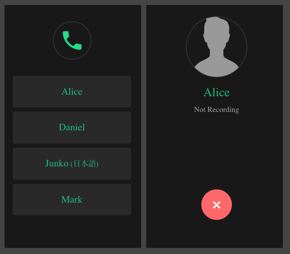

openai-whisper-talk
==========

`openai-whisper-talk` is a sample `voice conversation` application powered by [OpenAI](https://openai.com) technology such as [Whisper](https://openai.com/blog/whisper/), an automatic speech recognition (ASR) system, and [Text completion endpoint](https://beta.openai.com/docs/guides/completion/introduction), an interface to generate or manipulate text. The application is built using [Nuxt](https://nuxt.com/docs/getting-started/introduction), a Javascript framework based on [Vue.js](https://vuejs.org/guide/introduction.html).

`openai-whisper-talk`は、`Whisper`や`Text completion endpoint`など、`OpenAI`の技術を活用したサンプル音声会話アプリケーションです。このアプリケーションは、`Vue.js`をベースにしたJavascriptフレームワークである`Nuxt`を使用して構築されています。


# Objective

This is a `proof of concept` application to demonstrate `voice chat` between a human person and an AI.
I am sure that anyone who have tinkered with the `OpenAI` tools would have probably came up with the same idea, leveraging the different tools to create something interesting.

This is part of the series of projects I created as code exercise to study `Vue 3` and `Nuxt 3`. There are still lots of things I need to learn.


# The App



The user interface is like a normal phone. A list of AI friends is shown. You select an AI friend that you want to talk to and you will be shown the talk page. When you are finished, press the close button to go back to Home page.

Currently, there are 4 AI friends with different identity that you can talk to.

* **Alice**, responds in Valspeak (Valley girl) English
* **Daniel**, responds in Shakespearean, archaic English
* **Junko**, responds in Kansai Japanese
* **Mark**, responds in English

You can add more or edit the existing items by updating `assets/contacts.json` file.


# Audio Capture

`Audio data` is recorded automatically if sound is detected.
There is a threshold setting to eliminate background noise from triggering the audio capture. By default it is set to `-45dB` (0dB is the loudest sound). Adjust the variable `MIN_DECIBELS` if you want to set it to lower or higher depending on your needs.

When recording is enabled and sound is not detected for `2 seconds`, the audio data will be uploaded and sent to the backend for transcribing. You can adjust the time by editing `MAX_COUNT`.

Please note that transcribing time depends on the length of the audio data so it is possible that a new reply comes first before the old reply. To go around this limitation, at first I was thinking of setting the audio capture part like in `walkie-talkie` where you press a button to speak and wait for the reply after.

I suggest to run this app with your `headphone` or `earphone` attached to the machine or device. This will prevent the app from hearing its own reply. Also, please do not talk for too long, just one sentence at a time.


# Whisper

The `voice to text` part, using `Whisper`, takes time so do not expect instant reply.
I am developing this in an old machine and transcribing a simple '_Good morning_' takes about 5 seconds or so.
But perhaps in newer machines, it will be much faster.
I have set the `model` to `tiny` to adapt to my circumstance but if you find that your machine is faster, set it to [other models](https://github.com/openai/whisper#available-models-and-languages) for improved voice transcription.

One of the AI friend (`Junko`) that you can talk to will respond in Japanese. 
In this case it might be useful to set the `language` to Japanese and `task` to translate.

```sh
$ whisper audio.ogg --language English --task translate --model tiny --output_dir './public/upload'
```

By doing so, you can speak both in English and Japanese.

If the voice input will always be in English, it is not necessary to set it to the same language as the expected output reply. The `text completion` endpoint will take care of that.

Please note that the voice data will be uploaded in `public/upload` and the output files of `Whisper` will be saved in the same directory. I am not sure if it is possible to disable this. So you might see exponential increase of the number of files here. 

Anyway, there are other configuration options that you can use to make `whisper` more efficient in translating/transcribing the voice data. Please check `whisper --help`.


# Text Completion

By writing a [descriptive instruction](https://beta.openai.com/docs/guides/completion/conversation) in the beginning of the prompt for `Text Completion`, it is possible to create different identity to the response.

Also, to make the conversation seem more natural, the previous conversation is stored in the backend and attached to the prompt every time we made a request to the endpoint. This will make the AI remember previous details of the conversation and it is possible to infer to those details in your conversation. 

However, doing so makes the prompt longer as the conversation takes time. Please note that `completion endpoint` has a [maximum limit of 2048 tokens (4096 tokens for newer models)](https://beta.openai.com/docs/api-reference/completions/create#completions/create-max_tokens)(4 chars = 1 token). But you will not hit the maximum since I set the ceiling much lower for the app (1800 tokens). When you reach this point, I remove the oldest parts of the conversation so that the conversation can continue. By that time, the remove parts will probably not matter anymore since the conversion has already dragged on for so long.


# Text to Speech

Using [Web Speech API](https://developer.mozilla.org/en-US/docs/Web/API/Web_Speech_API), the text output from the `completion endpoint` will be spoken by a selected voice depending on the AI friend identity.

You can change the voice parameter by editing the `assets/contacts.json` file. You can check the available voices and test settings using this [page](https://mdn.github.io/dom-examples/web-speech-api/speak-easy-synthesis/).


# Nuxt

Currently, I am using the basic `fetch` function to send audio data to the backend. In the future, I will probably replace this with `useLazyFetch` which is supposedly non-blocking.

I also need to use `session` variable to store the chat conversation in the backend. I have seen [@sidebase/nuxt-session](https://github.com/sidebase/nuxt-session) but have not tried it yet.


# Setup

First, you need to install [`Whisper`](https://github.com/openai/whisper) and its `Python` dependencies

```sh
$ pip install git+https://github.com/openai/whisper.git
```

You also need `ffmpeg` installed on your system

```sh
# macos
$ brew install ffmpeg

# windows using chocolatey
$ choco install ffmpeg

# windows using scoop
$ scoop install ffmpeg
```

By this time, you can test `Whisper` using command line

```sh
$ whisper myaudiofile.ogg --language English --task translate
```

You can find sample audio files from [here](https://commons.wikimedia.org/wiki/Category:Audio_files_of_speeches).

If that is successful, you can proceed to install this app.

Clone the repository and install the dependencies

```sh
$ git clone https://github.com/supershaneski/openai-whisper-talk.git myproject

$ cd myproject

$ npm install
```

Create `.env` file in the root directory and supply your own [OpenAI API Key](https://beta.openai.com/docs/api-reference/authentication)

`.env` file
```javascript
NUXT_API_KEY=my-openai-api-key-sample
```

Then run the app

```sh
$ npm run dev
```

Open your browser to `http://localhost:5000/` (port number depends on availability) to load the application page.

## Using HTTPS

You might want to run this app using `https` protocol.
This is needed to enable audio capture using a separate device like a smartphone.

In order to do so, prepare the proper `certificate` and `key` files and edit `server.mjs` at the root directory.

Then buid the project

```sh
$ npm run build
```

Finally, run the app

```sh
$ node server.mjs
```

Now, open your browser to `https://localhost:3000/` (port number depends on availability) or use your local IP address to load the page.

