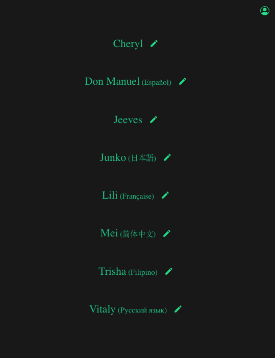
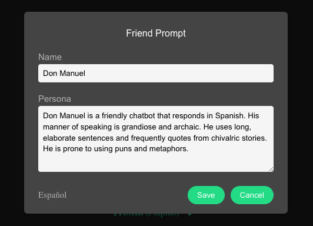
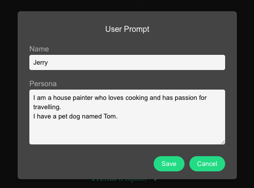
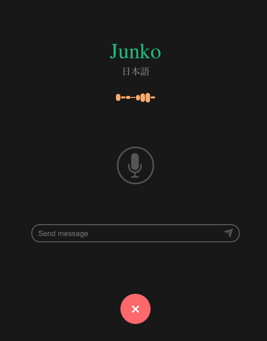

openai-whisper-talk
==========

v0.0.2

**openai-whisper-talk** is a sample voice conversation application powered by **OpenAI** technologies such as [Whisper](https://platform.openai.com/docs/guides/speech-to-text), an automatic speech recognition (ASR) system, [Chat Completions](https://platform.openai.com/docs/guides/text-generation/chat-completions-api), an interface that simulates conversation with a model that plays the role of assistant, [Embeddings](https://platform.openai.com/docs/guides/embeddings/what-are-embeddings), converts text to vector data that can be used in tasks like semantic searching, and the latest [Text-to-Speech](https://platform.openai.com/docs/guides/text-to-speech), that turn text ito lifelike spoken audio. The application is built using [Nuxt](https://nuxt.com/docs/getting-started/introduction), a Javascript framework based on [Vue.js](https://vuejs.org/guide/introduction.html).

The application has two new features: [Schedule Management](#schedule-management) and [Long-Term Memory](#long-term-memory). With Schedule Management, you can command the chatbot to add, modify, delete, and retrieve scheduled events. The Long-Term Memory feature allows you to store snippets of information that the chatbot will remember for future reference. You can seamlessly integrate both functions into your conversations simply by interacting with the chatbot. Perhaps in the future, with the addition of a few more enhancements, such as email or messaging capabilities, it can become a full-fledged personal assistant.

---

**openai-whisper-talk**は、[Whisper](https://platform.openai.com/docs/guides/speech-to-text)（自動音声認識（ASR）システム）、[Chat completions](https://platform.openai.com/docs/guides/text-generation/chat-completions-api)（アシスタントの役割を果たすモデルとの会話をシミュレートするインターフェース）、[Embeddings](https://platform.openai.com/docs/guides/embeddings/what-are-embeddings)（セマンティック検索などのタスクで使用できるベクターデータにテキストを変換する）、そして最新の[Text-to-speech](https://platform.openai.com/docs/guides/text-to-speech)（テキストをリアルな話し言葉のオーディオに変える）など、OpenAIの技術を駆使したサンプル音声会話アプリケーションです。このアプリケーションは、[Vue.js](https://vuejs.org/guide/introduction.html)に基づいたJavascriptフレームワークである[Nuxt](https://nuxt.com/docs/getting-started/introduction)を使用して構築されています。

このアプリケーションには、「[スケジュール管理](#schedule-management)」と「[永続メモリ](#long-term-memory)」の2つの新機能があります。スケジュール管理を使用すると、チャットボットにスケジュールイベントの追加、変更、削除、取得を指示できます。永続メモリ機能を使用すると、将来の参照のためにチャットボットが覚えておく情報のスニペットを保存できます。これらの機能をチャットボットとの対話を通じてシームレスに統合することができます。将来的に、いくつかの機能強化、たとえばメールやメッセージング機能を追加することで、完全な個人アシスタントになるかもしれません。


# The App



From the main page, you can choose which chatbot to engage with. Each chatbot has a distinct personality, speaks a different language, and possesses a unique voice. You can alter the name and personality of any chatbot by clicking the **Edit** button adjacent to its name. Currently, the user interface does not directly support the addition of new chatbots; however, you can manually add a chatbot and customize the voice and language settings for each by modifying the [assets/contacts.json](/assets/contacts.json) file.



Additionally, you can personalize your profile by clicking on the avatar icon in the upper right corner. This allows you to enter your name and share details about yourself, enabling the chatbot to interact with you in a more personalized manner.




# Audio Capture



Audio data is automatically recorded if sound is detected. A threshold setting is available to prevent background noise from triggering the audio capture. By default, this is set to **-45dB** (with 0dB representing the loudest sound). You can adjust this threshold by modifying the `MIN_DECIBELS`[^1] variable according to your needs.

When recording is enabled and no sound is detected for **3 seconds**, the audio data is uploaded and sent to the backend for transcription. It’s worth noting that in typical conversations, the average gap between each turn is around 2 seconds. Similarly, the pause between sentences when speaking is approximately the same. Therefore, I’ve chosen a duration that’s long enough to mean to wait for a reply. You can adjust this duration by editing the `MAX_COUNT`[^1] variable.

The system can continuously record audio data until a reply is received. Once the audio reply from the chatbot is received and played, audio recording is disabled to prevent inadvertent recording of the chatbot’s own response.

[^1]: You can find these variables in [pages/talk/[id].vue](/pages/talk/[id].vue) file.


# Whisper

All audio data is uploaded to the `public/upload` directory in M4A file format. Before submitting the audio file to the Whisper API, it is necessary to remove all silent segments. This step helps prevent the [well-known issue of hallucinations](https://github.com/openai/whisper/discussions/1369) generated by Whisper. For this same reason, it is recommended to set the `MIN_DECIBELS` value as high as possible, ensuring that only speech is recorded.

## Remove Silent Parts From Audio

To remove silent parts from the audio, we will be using `ffmpeg`. Be sure to [install it](#ffmpeg-setup).

```sh
ffmpeg -i sourceFile -af silenceremove=stop_periods=-1:stop_duration=1:stop_threshold=-50dB outputFile
```

In this command:
* `-1 sourceFile` specifies the input file.
* `-af silenceremove` applies the filter `silencerremove`.
* `stop_periods=-1` removes all periods of silence.
* `stop_duration=1` sets any period of silence longer than 1 second as silence.
* `stop_threshold=-50dB` sets any noise level below -50dB as silence.
* `outputFile` the output file.

To invoke this shell command in our api route, we will be using `exec` from `child-process` module.

Once the silent parts are removed, the file size should be checked. Typically, the resulting file size will be significantly smaller than the original. During this size check, files below **16 KB** are disregarded, based on the assumption that, with a 16-bit depth, such a file corresponds to approximately to at least one second of audio.

```
file_size = duration in seconds x bitrate
```

The entire process, from eliminating silence to verifying file size, is designed to ensure that only viable audio data is sent to the Whisper API. Our aim is to avoid the unnecessary transmission of data.

Having confirmed the viability of our audio data, we then proceed to call the Whisper API.

```javascript
const transcription = await openai.audio.transcriptions.create({
    file: fs.createReadStream(filename),
    language: lang,
    response_format: 'text',
    temperature: 0,
})
```

where `lang` is the [ISO 639-1](https://en.wikipedia.org/wiki/List_of_ISO_639-1_codes) code of the specified language of our chatbot. Please check the [list of the currently supported language](https://platform.openai.com/docs/guides/speech-to-text/supported-languages).

We opt for a simple `text` format since timestamps are not required, and we set the `temperature` parameter to zero to achieve deterministic output.


# Chat Completions API

After receiving the transcript from Whisper, we proceed to submit it to the Chat Completions API with function calling. We utilize the latest [OpenAI Node.js module (version 4)](https://www.npmjs.com/package/openai) that was released yesterday (2023/11/07), which includes an [updated function-calling format](https://platform.openai.com/docs/guides/function-calling). This newest iteration enables the invocation of multiple functions in a single request.

```javascript
let messages = [{ role: 'system', content: system_prompt }]

let all_history = await mongoDb.getMessages()
if(all_history.length > 0) {
    const history_context = trim_array(all_history, 20)
    messages = messages.concat(history_context)
}

messages.push({ role: 'user', content: user_query })

let response = await openai.chat.completions.create({
    temperature: 0.3,
    messages,
    tools: [
        { type: 'function', function: add_calendar_entry },
        { type: 'function', function: get_calendar_entry },
        { type: 'function', function: edit_calendar_entry },
        { type: 'function', function: delete_calendar_entry },
        { type: 'function', function: save_new_memory },
        { type: 'function', function: get_info_from_memory }
    ]
})
```

## The System Prompt

The system prompt plays a crucial role in giving life to our chatbot. It is here where we establish its name and persona, based on the chatbot chosen by the user. We provide it with specific instructions on how to respond, along with a list of functions it can execute. We also inform it about the user's identity and some personal details. Finally, we set the current date and time, which is essential for activating calendar functions.

```javascript
const today = new Date()

let system_prompt = `In this session, we will simulate a voice conversation between two friends.\n\n` +
    
    `# Persona\n` +
    `You will act as ${selPerson.name}.\n` +
    `${selPerson.prompt}\n\n` +
    `Please ensure that your responses are consistent with this persona.\n\n` +

    `# Instructions\n` +
    `The user is talking to you over voice on their phone, and your response will be read out loud with realistic text-to-speech (TTS) technology.\n` +
    `Use natural, conversational language that are clear and easy to follow (short sentences, simple words).\n` +
    `Keep the conversation flowing.\n` +
    `Sometimes the user might just want to chat. Ask them relevant follow-up questions.\n\n` +
    
    `# Functions\n` +
    `You have the following functions that you can call depending on the situation.\n` +
    `add_calendar_entry, to add a new event.\n` +
    `get_calendar_entry, to get the event at a particular date.\n` +
    `edit_calendar_entry, to edit or update existing event.\n` +
    `delete_calendar_entry, to delete an existing event.\n` +
    `save_new_memory, to save new information to memory.\n` +
    `get_info_from_memoryn, to retrieve information from memory.\n\n` +

    `When you present the result from the function, only mention the relevant details for the user query.\n` +
    `Omit information that is redundant and not relevant to the query.\n` +
    `Always be concise and brief in your replies.\n\n` +

    `# User\n` +
    `As for me, in this simulation I am known as ${user_info.name}.\n` +
    `${user_info.prompt}\n\n` +

    `# Today\n` +
    `Today is ${today}.\n`
```

## Context

All messages will be stored in **MongoDB**.

To manage tokens and avoid surpassing the model's maximum limit, we will only send the last 20 interactions. The `trim_array` function is designed to prune the message history if it surpasses 20 turns. This threshold can be adjusted to meet your specific requirements.

```javascript
const history_context = trim_array(all_history, 15)
```

From the main screen, you have the option to erase the previous history for each chatbot. Every message, whether from the user or the chatbot, is saved with the chatbot's ID, allowing us to trace the messages back to their respective conversations.


## Function Calling

Please note that we have separated the handling of function calling ([function_call.js](/server/api/function_call.js)) from the main Chat Completions API call ([transcribe.php](/server/api/transcribe.js)). This distinction is made to address instances when text content is present while a function call is invoked, which is typically null. This separation enables the app to display the text while simultaneously processing the function call. I have also enclosed the process within a loop in the event that a second API call results in another function call. At present, there is no safeguard to interrupt the loop should it continue indefinitely. This issue could be resolved by implementing **streaming**, but I have yet to determine how to apply streaming within Nuxt.

Our functions are categorized under two new features: **Schedule Management** and **Long-Term Memory**.

Let's first examine how we manage function calling with the new format. We must utilize the new **tools** parameter instead of the now-deprecated **functions** parameter to enable the invocation of multiple function calls.

```javascript
let response = await openai.chat.completions.create({
    temperature: 0.3,
    messages,
    tools: [
        { type: 'function', function: add_calendar_entry },
        { type: 'function', function: get_calendar_entry },
        { type: 'function', function: edit_calendar_entry },
        { type: 'function', function: delete_calendar_entry },
        { type: 'function', function: save_new_memory },
        { type: 'function', function: get_info_from_memory }
    ]
})
```

Check the **JSON Schema** of each functions from `lib/` directory.
Here is for `add_calendar_entry`:

```javascript
{
    "name": "add_calendar_entry",
    "description": "Adds a new entry to the calendar",
    "parameters": {
        "type": "object",
        "properties": {
            "event": {
                "type": "string",
                "description": "The name or title of the event"
            },
            "date": {
                "type": "string",
                "description": "The date of the event in 'YYYY-MM-DD' format"
            },
            "time": {
                "type": "string",
                "description": "The time of the event in 'HH:MM' format"
            },
            "additional_detail": {
                "type": "string",
                "description": "Any additional details or notes related to the event"
            }
        },
        "required": [ "event", "date", "time", "additional_detail" ]
    }
}
```

To dicuss how all these works, let's move on to the [next section](#schedule-management).


### Schedule Management

For **Schedule Management**, we have the following functions:
* [add_calendar_entry](/lib/add_calendar_entry.json), adds new calendar entry
* [edit_calendar_entry](/lib/edit_calendar_entry.json), edits calendar entry by event name
* [get_calendar_entry](/lib/get_calendar_entry.json), retrieves calendar entries by date
* [delete_calendar_entry](/lib/delete_calendar_entry.json), deletes calendar entry either by event name or by date[^2].

[^2]: If by date, item needs to be only one under the date otherwise an error will be returned.

All calendar entries will be stored in MongoDB in different collection from messages. It will be accessible to all chatbots.

Let’s take a look at a sample chat conversation to demonstrate how these elements interact:

> user: Hi, Jeeves. Can you check my schedule for Friday and Saturday?

Function calling (invoked 2 get_calendar_entry):
```
{                                                                        
  role: 'assistant',
  content: null,
  tool_calls: [                                                                      
  {
    id: 'call_ub2tlAxACwovuyNUfRHyU6tZ',
    type: 'function',
    function: { name: 'get_calendar_entry', arguments: '{"date": "2023-11-10"}' }
  },
  {
    id: 'call_uIoadWqQSaxunFBxe3SAYmcN',
    type: 'function',
    function: { name: 'get_calendar_entry', arguments: '{"date": "2023-11-11"}' }
  }
]
}
```

Function output:
```
[                                                                        
  {
    tool_call_id: 'call_ub2tlAxACwovuyNUfRHyU6tZ',
    role: 'tool',
    name: 'get_calendar_entry',
    content: '{\n' +
      '  "message": "Found 3 entries",\n' +
      '  "items": [\n' +
      '    {\n' +
      '      "_id": "6549f504b9537c6b5cb82284",\n' +
      '      "event": "Dinner with Anna",\n' +
      '      "date": "2023-11-10",\n' +
      '      "time": "19:00",\n' +
      '      "additional_detail": "Electric Sheep Bar",\n' +
      '      "__v": 0\n' +
      '    },\n' +
      '    {\n' +
      '      "_id": "654b2805e51fcd815dea8e2d",\n' +
      '      "event": "Project presentation",\n' +
      '      "date": "2023-11-10",\n' +
      '      "time": "10:00",\n' +
      '      "additional_detail": "Important project presentation",\n' +
      '      "__v": 0\n' +
      '    },\n' +
      '    {\n' +
      '      "_id": "654b2805e51fcd815dea8e30",\n' +
      '      "event": "Meet Tony at Electric Sheep Bar",\n' +
      '      "date": "2023-11-10",\n' +
      '      "time": "19:00",\n' +
      '      "additional_detail": "Meet Tony at Electric Sheep Bar in Susukino",\n' +
      '      "__v": 0\n' +
      '    }\n' +
      '  ]\n' +
      '}'
  },
  {
    tool_call_id: 'call_uIoadWqQSaxunFBxe3SAYmcN',
    role: 'tool',
    name: 'get_calendar_entry',
    content: '{\n' +
      '  "message": "Found 1 entries",\n' +
      '  "items": [\n' +
      '    {\n' +
      '      "_id": "6549f504b9537c6b5cb82287",\n' +
      '      "event": "Hiking in Maruyama with Susan",\n' +
      '      "date": "2023-11-11",\n' +
      '      "time": "11:00",\n' +
      '      "additional_detail": "Hiking in Maruyama",\n' +
      '      "__v": 0\n' +
      '    }\n' +
      '  ]\n' +
      '}'
  }
]
```

Chat summary:
```
{                                                                        
  role: 'assistant',
  content: 'On Friday, you have the following events:\n' +
    '1. Project presentation at 10:00 - Important project presentation\n' +
    '2. Dinner with Anna at 19:00 - Electric Sheep Bar\n' +
    '3. Meet Tony at Electric Sheep Bar at 19:00\n' +
    '\n' +
    'On Saturday, you have:\n' +
    '1. Hiking in Maruyama with Susan at 11:00 - Hiking in Maruyama'
}
```

> user: I see, it seems I will be meeting both Anna and Tony at the Electric Sheep bar at 7PM, right?

Chat API:
```
{                                                                        
  role: 'assistant',
  content: "That's correct, you have a dinner with Anna and a meeting with Tony at the Electric Sheep Bar at 7:00 PM on Friday."
}
```

> user: can you unify the schedule for 7PM into one and remove the other? Just to tidy my schedule list.

Function calling (invoked delete_calendar_entry and edit_calendar_entry):
```
{                                                                        
  role: 'assistant',
  content: null,
  tool_calls: [                                                                      
  {
    id: 'call_1mUow81jfWJkjIHnDvfbai4V',
    type: 'function',
    function: {
      name: 'delete_calendar_entry',
      arguments: '{"delete_type": "event_name", "event": "Dinner with Anna at 19:00"}'
    }
  },
  {
    id: 'call_g4np5NzrvJGn5s47xxl2me0D',
    type: 'function',
    function: {
      name: 'edit_calendar_entry',
      arguments: '{"event": "Meet Tony at Electric Sheep Bar", "date": "2023-11-10", "time": "19:00", "additional_detail": "Meeting with Tony at Electric Sheep Bar"}'
    }
  }
]
}
```

Function output:
```
[                                                                        
  {
    tool_call_id: 'call_1mUow81jfWJkjIHnDvfbai4V',
    role: 'tool',
    name: 'delete_calendar_entry',
    content: '{}'
  },
  {
    tool_call_id: 'call_g4np5NzrvJGn5s47xxl2me0D',
    role: 'tool',
    name: 'edit_calendar_entry',
    content: '{\n  "message": "Entry edited"\n}'
  }
]
```

Chat summary:
```
{                                                                        
  role: 'assistant',
  content: 'The schedule has been updated. The event "Dinner with Anna at 19:00" has been removed, and the event "Meet Tony at Electric Sheep Bar" has been edited to 19:00.'
}
```

> user: okay just to confirm the update, can you tell me again my schedule on Friday?

Function calling (invoked get_calendar_entry):
```
{                                                                        
  role: 'assistant',
  content: null,
  tool_calls: [                                                                      
  {
    id: 'call_IN3pxCJK8FGJ9IZT6oS8Oarc',
    type: 'function',
    function: { name: 'get_calendar_entry', arguments: '{"date":"2023-11-10"}' }
  }
]
}
```

Function output:
```
[                                                                        
  {
    tool_call_id: 'call_IN3pxCJK8FGJ9IZT6oS8Oarc',
    role: 'tool',
    name: 'get_calendar_entry',
    content: '{\n' +
      '  "message": "Found 2 entries",\n' +
      '  "items": [\n' +
      '    {\n' +
      '      "_id": "654b2805e51fcd815dea8e2d",\n' +
      '      "event": "Project presentation",\n' +
      '      "date": "2023-11-10",\n' +
      '      "time": "10:00",\n' +
      '      "additional_detail": "Important project presentation",\n' +
      '      "__v": 0\n' +
      '    },\n' +
      '    {\n' +
      '      "_id": "654b2805e51fcd815dea8e30",\n' +
      '      "event": "Meet Tony at Electric Sheep Bar",\n' +
      '      "date": "2023-11-10",\n' +
      '      "time": "19:00",\n' +
      '      "additional_detail": "Meeting with Tony at Electric Sheep Bar",\n' +
      '      "__v": 0\n' +
      '    }\n' +
      '  ]\n' +
      '}'
  }
]
```

Chat summary:
```
{                                                                        
  role: 'assistant',
  content: 'On Friday, you have the following events:\n' +
    '1. Project presentation at 10:00 - Important project presentation\n' +
    '2. Meet Tony at Electric Sheep Bar at 19:00 - Meeting with Tony at Electric Sheep Bar'
}
```

> user: Ah, you need to add that I will also be meeting Anna at 7PM with Tony. Can you edit it again?

Function calling(invoked edit_calendar_entry):
```
{                                                                        
  role: 'assistant',
  content: null,
  tool_calls: [                                                                      
  {
    id: 'call_M8C34lgYji0wHDi6hrTvlJtF',
    type: 'function',
    function: {
      name: 'edit_calendar_entry',
      arguments: '{"event":"Meet Tony at Electric Sheep Bar","date":"2023-11-10","time":"19:00","additional_detail":"Meeting with Tony and Anna at Electric Sheep Bar"}'
    }
  }
]
}
```

Function output:
```
[                                                                        
  {
    tool_call_id: 'call_M8C34lgYji0wHDi6hrTvlJtF',
    role: 'tool',
    name: 'edit_calendar_entry',
    content: '{\n  "message": "Entry edited"\n}'
  }
]
```

Chat summary:
```
{                                                                        
  role: 'assistant',
  content: 'The event has been updated to "Meeting with Tony and Anna at Electric Sheep Bar" at 19:00 on Friday.'
}
```

You can clearly see how the AI was able to call the functions for different situations.

### Long-Term Memory

For **Long-Term Memory**, we have the following functions
* [save_new_memory](/lib/save_new_memory.json), saves new memory.
* [get_info_from_memory](/lib/get_info_from_memory.json), retrieves info from memory based on search terms.

`save_new_memory` is pretty straight forward. It just saves the info returned by the function call to the database.

`get_info_from_memory` is a bit more exciting. All the other functions have been invoking normal database functions. This is because we can easily do calendar function using typical database calls. However, for retrieving info from memory based on user query, we cannot just simply do that. We cannot just do word lookup. We need to consider the context. We need to do semantic search.


# FFMPEG Setup

[FFMPEG](https://ffmpeg.org/) is used to remove silent parts in the audio file.

To install ffmpeg command-line tool
```
# on Ubuntu or Debian
sudo apt update && sudo apt install ffmpeg

# on Arch Linux
sudo pacman -S ffmpeg

# on MacOS using Homebrew (https://brew.sh/)
brew install ffmpeg

# on Windows using Chocolatey (https://chocolatey.org/)
choco install ffmpeg

# on Windows using Scoop (https://scoop.sh/)
scoop install ffmpeg
```

# MongoDB Setup

[MongoDB](https://www.mongodb.com/try/download/community) will be used to store calendar entries and for long-term memory function.

To install MongoDB Community Edition, please check this [page](https://www.mongodb.com/docs/manual/installation/).
You might also want to [install MongoDB Shell](https://www.mongodb.com/docs/mongodb-shell/install/) to view the database.


# App Setup

First, be sure that [ffmpeg](#ffmpeg-setup) and [MongoDB](#mongodb-setup) are installed in your system.

To clone the project repository and install the dependencies

```sh
$ git clone https://github.com/supershaneski/openai-whisper-talk.git myproject

$ cd myproject

$ npm install
```

Copy `.env.example` file and rename to `.env`, then open it and edit the items there with actual values. For the MongoDB items, you probably do not need to edit them unless you have different setup.

```
NUXT_OPENAI_API_KEY=your-openai-api-key
NUXT_MONGODB_HOST_NAME=localhost
NUXT_MONGODB_PORT=27017
NUXT_MONGODB_DB_NAME=embeddingvectorsdb
```

Then to run the app

```sh
$ npm run dev
```

Open your browser to `http://localhost:5000/` (port number depends on availability) to load the application page.


## Using HTTPS

> **Note:** I have not yet tested this with the latest update

You might want to run this app using `https` protocol.
This is needed to enable audio capture using a separate device like a smartphone.

In order to do so, prepare the proper `certificate` and `key` files and edit `server.mjs` at the root directory.

Then buid the project

```sh
$ npm run build
```

Finally, run the app

```sh
$ node server.mjs
```

Now, open your browser to `https://localhost:3000/` (port number depends on availability) or use your local IP address to load the page.

